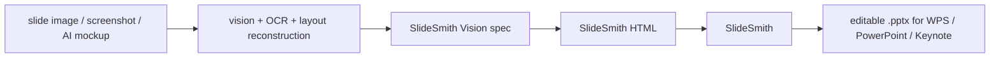

# SlideSmith Vision

**Bridge visual slide reconstruction into [SlideSmith](https://github.com/AliceLJY/slidesmith).**

SlideSmith turns HTML slides into editable `.pptx` files. SlideSmith Vision sits one step upstream: it converts a simple visual reconstruction spec into SlideSmith-compatible HTML, so screenshots, AI-generated slide mockups, or vision/OCR outputs can become editable PowerPoint/WPS decks through the existing SlideSmith engine.

## How It Fits With SlideSmith



SlideSmith should stay focused on one job: **HTML to editable PPTX**.

SlideSmith Vision owns the upstream reconstruction layer:

- image/OCR/layout output normalization
- hybrid editability decisions
- chart or figure raster fallbacks
- generating SlideSmith-compatible HTML
- example specs for screenshot-to-PPTX workflows

## Current Scope

This repository currently provides a small `spec -> HTML` bridge. It does not try to solve full automatic OCR or layout inference yet.

Supported spec elements:

- editable text boxes
- rectangles, rounded rectangles, ovals, and simple triangles
- straight lines
- raster image fallbacks

## Quick Start

Generate SlideSmith HTML:

```bash
npm test
# writes /tmp/slidesmith-vision-basic.html
```

Or run directly:

```bash
node bin/cli.mjs examples/basic/spec.json -o /tmp/basic.html
```

Then convert with SlideSmith:

```bash
node ../slidesmith/bin/cli.mjs /tmp/basic.html -o /tmp/basic.pptx --no-fonts
```

## Spec Format

```json
{
  "canvas_width": 1920,
  "canvas_height": 1080,
  "slides": [
    {
      "background": "#ffffff",
      "elements": [
        {
          "type": "text",
          "x": 120,
          "y": 90,
          "w": 900,
          "h": 80,
          "text": "Editable title",
          "font_size": 42,
          "font_face": "Arial",
          "color": "#111111",
          "bold": true
        }
      ]
    }
  ]
}
```

Coordinates are source-canvas pixels. The generated HTML uses the same pixel canvas, which lets the browser layout engine and SlideSmith preserve positions.

## Reconstruction Policy

Do not force everything into vector objects. Use a hybrid strategy:

- keep readable text editable
- rebuild simple cards, labels, pills, and diagram nodes as shapes
- preserve dense charts, photos, screenshots, heatmaps, and complex illustrations as raster crops
- record source image paths for traceability

This matches the practical WPS workflow: key text can be edited, while complex visuals stay visually faithful.

## License

[MIT](LICENSE)
