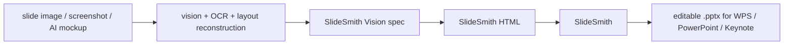

# SlideSmith Vision

**Convert visual slide reconstruction specs into validated, [SlideSmith](https://github.com/AliceLJY/slidesmith)-compatible HTML.**

SlideSmith Vision does not create PPTX files. It sits one step upstream: this package converts a visual reconstruction spec into HTML, then downstream SlideSmith can convert that HTML into an editable `.pptx` for PowerPoint or WPS.

## How It Fits With SlideSmith



SlideSmith should stay focused on one job: **HTML to editable PPTX**.

SlideSmith Vision owns the upstream reconstruction layer:

- image/OCR/layout output normalization
- hybrid editability decisions
- chart or figure raster fallbacks
- generating SlideSmith-compatible HTML
- example specs for downstream SlideSmith workflows

## Usage

```sh
slidesmith-vision <spec.json> -o <output.html> [--allow-missing-images]
```

The command validates the reconstruction spec and emits SlideSmith-compatible HTML. Readable local images are inlined as data URIs, so successful default output does not depend on local image files. The command never creates PPTX itself; pass the HTML to SlideSmith as a separate downstream step.

Missing or unreadable local images fail by default. The error identifies the spec file and the exact `slides[n].elements[n].path` or `.src` entry. HTTP(S), protocol-relative (`//cdn.example/image.png`), and data URLs are preserved as external references. To preserve another original image source instead, opt in explicitly:

```sh
slidesmith-vision spec.json -o output.html --allow-missing-images
```

The opt-in mode prints a warning and may preserve a local-file dependency. HTTP(S) image URLs are also preserved as external references, while existing data URIs are preserved as-is. Output is self-contained only when the spec has no external URLs and every local image is successfully inlined.

The input spec and output HTML must be different files. The CLI rejects direct, symlinked, and hard-linked aliases before writing so an accidental `spec.json -o spec.json` cannot destroy the source spec.

## Current Scope

This repository currently provides a small `spec -> HTML` bridge for downstream SlideSmith, with validation and local-image inlining. It does not try to solve full automatic OCR, layout inference, or PPTX creation.

Supported spec elements:

- editable text boxes
- rectangles, rounded rectangles, ovals, and simple triangles
- straight lines
- raster image fallbacks — readable local image paths (relative to the spec file) are inlined as base64 data URIs (see `examples/with-image/`)

## Quick Start

Run the deterministic conversion and validation tests:

```bash
npm test
```

Generate SlideSmith-compatible HTML:

```bash
node bin/cli.mjs examples/basic/spec.json -o /tmp/basic.html
```

Then, as a separate downstream step, convert with SlideSmith:

```bash
node ../slidesmith/bin/cli.mjs /tmp/basic.html -o /tmp/basic.pptx --no-fonts
```

## Spec Format

```json
{
  "canvas_width": 1920,
  "canvas_height": 1080,
  "slides": [
    {
      "background": "#ffffff",
      "elements": [
        {
          "type": "text",
          "x": 120,
          "y": 90,
          "w": 900,
          "h": 80,
          "text": "Editable title",
          "font_size": 42,
          "font_face": "Arial",
          "color": "#111111",
          "bold": true
        }
      ]
    }
  ]
}
```

Coordinates are source-canvas pixels. The generated HTML uses the same pixel canvas, which lets the browser layout engine and SlideSmith preserve positions.

The lightweight built-in validator requires:

- a top-level object with positive numeric `canvas_width` and `canvas_height`
- a non-empty top-level `slides` array
- an `elements` array on every slide (it may be empty for an intentional blank slide)
- a supported string `type` plus numeric `x` and `y` on every element
- positive numeric `w` and `h` for text, shape, and image elements
- numeric, non-identical `x`/`y` and `x2`/`y2` endpoints for lines
- string `text` for text elements and a non-empty string `path` or `src` for images

Invalid specs fail before the output file is written rather than producing an empty document or silent `0px` elements.

## Reconstruction Policy

Do not force everything into vector objects. Use a hybrid strategy:

- keep readable text editable
- rebuild simple cards, labels, pills, and diagram nodes as shapes
- preserve dense charts, photos, screenshots, heatmaps, and complex illustrations as raster crops
- record source image paths for traceability

This matches the practical WPS workflow: key text can be edited, while complex visuals stay visually faithful.

## License

[MIT](LICENSE)
