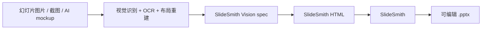

# SlideSmith Vision

**把视觉重建 spec 转成经过校验、兼容 [SlideSmith](https://github.com/AliceLJY/slidesmith) 的 HTML。**

SlideSmith Vision 本身不创建 PPTX。它位于上游：把视觉重建得到的结构化 spec 转成 HTML；如需可编辑 `.pptx`，再把 HTML 交给下游的 SlideSmith 转换。

## 和 SlideSmith 的分工



SlideSmith 主仓库继续保持干净：只做 **HTML -> editable PPTX**。

SlideSmith Vision 负责上游：

- 统一 OCR / vision / layout 输出格式
- 判断哪些元素该可编辑、哪些该保留为裁图
- 把重建结构转成 SlideSmith HTML
- 保存供下游 SlideSmith 使用的视觉重建样例

## 使用

不发布到 npm，先 clone 到本地并安装依赖：

```sh
git clone https://github.com/AliceLJY/slidesmith-vision.git && cd slidesmith-vision && npm install
```

在仓库里跑一次 `npm link` 可以拿到全局的 `slidesmith-vision` 命令（下面的示例默认你已经这么做了）；不然就把 `slidesmith-vision` 换成 `node bin/cli.mjs`。

```sh
slidesmith-vision <spec.json> -o <output.html> [--allow-missing-images]
```

CLI 会先校验 spec，再生成兼容 SlideSmith 的 HTML。可读取的本地图片会被内联为 data URI，因此默认成功生成的结果不再依赖本地图片文件。这个命令只输出 HTML，不会直接生成 PPTX。

本地图片缺失或无法读取时，默认直接失败；错误会写明 spec 文件路径以及对应的 `slides[n].elements[n].path` 或 `.src`。HTTP(S)、协议相对地址（`//cdn.example/image.png`）和 data URL 会按外部引用保留。如果确实要保留其他原始图片地址，可以显式使用：

```sh
slidesmith-vision spec.json -o output.html --allow-missing-images
```

此模式会打印明确警告，并可能保留本地文件依赖。HTTP(S) 图片地址会继续作为外部引用保留，已有 data URI 则原样保留。只有 spec 不含外部 URL、且所有本地图片都成功内联时，输出才是自包含 HTML。

输入 spec 与输出 HTML 必须是不同文件。CLI 在写入前会拒绝同一路径、指向输入的符号链接以及硬链接，避免 `spec.json -o spec.json` 意外毁掉原始 spec。

## 当前范围

现在先提供一个带校验和本地图片内联的 `spec -> HTML` 桥，供下游 SlideSmith 使用；不声称已经解决全自动 OCR、布局推断或 PPTX 创建。

支持元素：

- 可编辑文本框
- 矩形、圆角矩形、圆形、简单三角形
- 直线
- 复杂图表/图片裁图 fallback——可读取的本地图片路径（相对 spec 文件解析）会内联成 base64 data URI（见 `examples/with-image/`）

## 快速测试

```bash
npm test
```

`npm test` 会运行基础转换、图片内联、缺图失败、显式 fallback 和非法 spec 的确定性断言。要生成 HTML，可直接执行：

```bash
node bin/cli.mjs examples/basic/spec.json -o /tmp/basic.html
```

如需 PPTX，再单独调用下游 SlideSmith：

```bash
node ../slidesmith/bin/cli.mjs /tmp/basic.html -o /tmp/basic.pptx --no-fonts
```

## Spec 格式

```json
{
  "canvas_width": 1920,
  "canvas_height": 1080,
  "slides": [
    {
      "background": "#ffffff",
      "elements": [
        {
          "type": "text",
          "x": 120,
          "y": 90,
          "w": 900,
          "h": 80,
          "text": "Editable title",
          "font_size": 42,
          "font_face": "Arial",
          "color": "#111111",
          "bold": true
        }
      ]
    }
  ]
}
```

坐标是源画布像素。生成的 HTML 使用同一套像素画布，浏览器排版引擎和 SlideSmith 才能据此保留元素位置。

## Spec 校验

内置校验器不依赖第三方包，主要要求：

- 顶层必须是对象，包含大于 0 的数字 `canvas_width`、`canvas_height`
- 顶层 `slides` 必须是非空数组
- 每页必须有 `elements` 数组；有意保留空白页时可用空数组
- 每个元素必须有受支持的字符串 `type` 和数字 `x`、`y`
- 文本、形状、图片必须有大于 0 的数字 `w`、`h`
- 直线必须有数字端点 `x`/`y`、`x2`/`y2`，且两个端点不能重合
- 文本元素必须有字符串 `text`；图片元素必须有非空字符串 `path` 或 `src`

非法 spec 会在写输出文件前失败，不再静默生成空文档或 `0px` 元素。

## 设计原则

不要强行把所有东西都矢量化。更实用的策略是：

- 可读文字保持可编辑
- 卡片、标签、pill、流程节点尽量用形状重建
- 密集图表、照片、截图、热力图、复杂插画保留为裁图
- 保留源图路径，便于追溯和人工复核

这样最符合 WPS 里的实际使用：关键文字能改，复杂视觉不失真。

## 许可证

[MIT](LICENSE)
