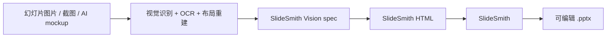

# SlideSmith Vision

**把图片/截图/AI 生成的幻灯片草图，接到 [SlideSmith](https://github.com/AliceLJY/slidesmith) 的可编辑 PPTX 生成链路上。**

SlideSmith 负责 HTML 到可编辑 `.pptx`。SlideSmith Vision 放在上游：把视觉重建得到的结构化 spec 转成 SlideSmith 可吃的 HTML，再交给 SlideSmith 输出 WPS/PowerPoint/Keynote 可编辑的 PPTX。

## 和 SlideSmith 的分工



SlideSmith 主仓库继续保持干净：只做 **HTML -> editable PPTX**。

SlideSmith Vision 负责上游：

- 统一 OCR / vision / layout 输出格式
- 判断哪些元素该可编辑、哪些该保留为裁图
- 把重建结构转成 SlideSmith HTML
- 保存 screenshot-to-PPTX 的测试样例

## 当前范围

现在先提供一个最小可用的 `spec -> HTML` 桥，不声称已经解决全自动 OCR 和布局推断。

支持元素：

- 可编辑文本框
- 矩形、圆角矩形、圆形、简单三角形
- 直线
- 复杂图表/图片裁图 fallback——本地图片路径（相对 spec 文件解析）会内联成 base64 data URI，生成的 HTML 自包含、在任何地方都能转换（见 `examples/with-image/`）

## 快速测试

```bash
npm test
# 输出 /tmp/slidesmith-vision-basic.html
```

或者：

```bash
node bin/cli.mjs examples/basic/spec.json -o /tmp/basic.html
node ../slidesmith/bin/cli.mjs /tmp/basic.html -o /tmp/basic.pptx --no-fonts
```

## 设计原则

不要强行把所有东西都矢量化。更实用的策略是：

- 可读文字保持可编辑
- 卡片、标签、pill、流程节点尽量用形状重建
- 密集图表、照片、截图、热力图、复杂插画保留为裁图
- 保留源图路径，便于追溯和人工复核

这样最符合 WPS 里的实际使用：关键文字能改，复杂视觉不失真。
